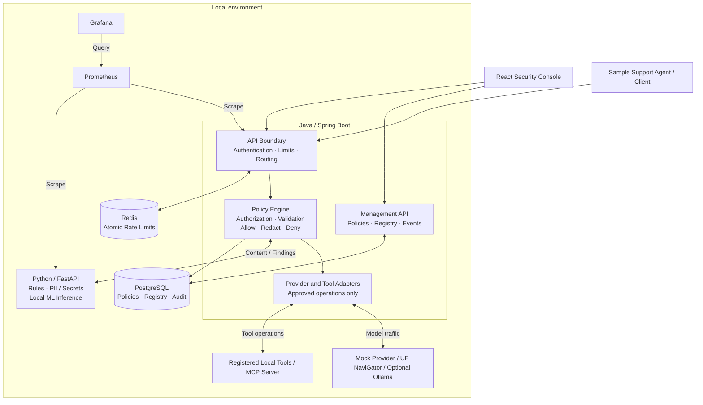
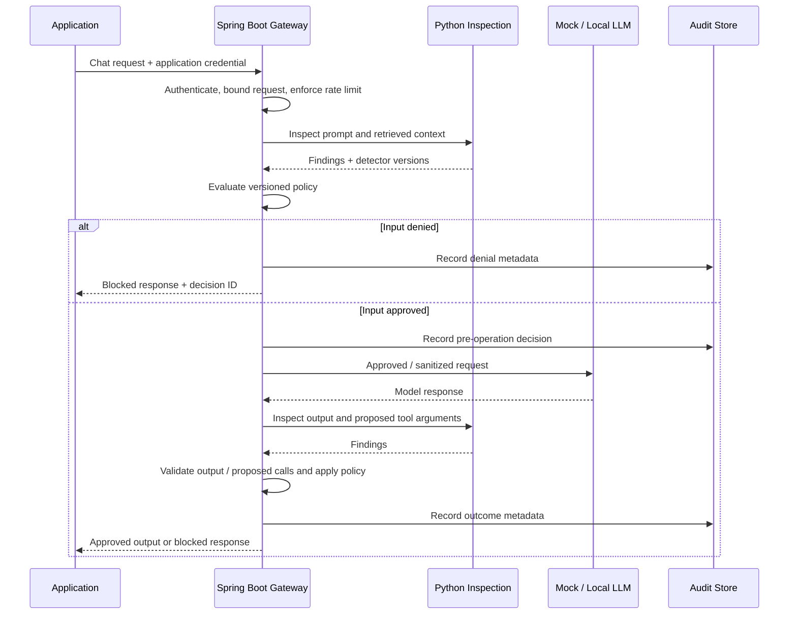

# SentinelLLM — Final Project Plan

**Project:** AI Security Gateway for Agentic Applications  
**Plan date:** September 30, 2026  
**Status:** Phase 7 CI/CD, local Kubernetes and Terraform implemented and validated; evidence recorded in docs/phase-7/  
**Budget:** No paid APIs or hosted infrastructure required for development and demonstration

## 1. Objective

Build a gateway that inspects LLM requests, retrieved context, model responses, and agent tool operations before allowing protected actions. Deliver a working security product with a presentable demo, reproducible local deployment, adversarial tests, detection evaluation, and performance measurements.

The project targets the supplied Staff Software Engineer (MS) role. Its strongest evidence will be hands-on Java and Python development, AI/ML experimentation, cybersecurity reasoning, networking, distributed systems, automated delivery, and operational ownership. The supplied role explicitly lists Java and Python, Docker/Kubernetes, CI/CD, observability, and infrastructure-as-code. Terraform is not named, but demonstrates the infrastructure-as-code requirement.

This project will demonstrate specific controls and measured detection performance. It will not claim comprehensive protection against arbitrary prompt injection or production readiness without supporting evidence.

## 2. Agreed decisions

| Decision | Selection |
|---|---|
| Gateway language | Java with Spring Boot; replaces Go |
| Detection and ML | Python with FastAPI |
| Policy authority | Spring Boot owns final authorization and allow/redact/deny decisions |
| User-facing demo | React + TypeScript security console and sample support agent |
| Durable storage | PostgreSQL |
| Distributed rate limiting | Redis |
| Initial model integration | Deterministic mock provider |
| Real model demonstration | UF NaviGator API with configurable model, initially `gpt-oss-120b`; optional smaller local model through Ollama |
| Development environment | Docker Compose |
| Deployment demonstration | Local Kubernetes using kind |
| Infrastructure-as-code | Terraform Community Edition, managing resources in the local cluster |
| CI/CD | GitHub Actions within free usage allowances |
| Observability | Self-hosted Prometheus and Grafana |
| Paid cloud deployment | Optional future extension; not a completion requirement |

Exact supported versions will be selected and pinned at implementation time. Use a maintained OpenJDK distribution and compatible Spring Boot release. Start with Spring MVC and virtual threads where supported; benchmark before introducing reactive programming or native compilation.

## 3. Product scope

### Integration surfaces

1. **LLM gateway:** An OpenAI-compatible subset for non-streaming, text-based chat. Inspect outgoing messages and incoming model responses.
2. **RAG inspection:** Inspect retrieved chunks before applications assemble model context. Preserve document identifiers and source/trust labels.
3. **Tool gateway:** Authorize, validate, inspect, and execute calls to registered tools. Inspect tool results before returning them to the agent.
4. **MCP adapter:** Support a documented transport and method subset, initially focusing on tool discovery and invocation.
5. **Management API:** Manage versioned policies, registered tools, and authenticated access to security events.

Tool enforcement requires execution through the tool gateway. An advisory inspection endpoint cannot stop an application from executing a tool directly. Similarly, an application using a standalone RAG inspection endpoint must obey its decision; the integrated gateway must reject denied context before forwarding it.

### Required capabilities

| Capability | Planned behavior |
|---|---|
| Prompt injection | Detect baseline instruction override, role hijacking, and indirect injection patterns; later evaluate a local classifier |
| Jailbreaks | Detect selected restriction-bypass patterns; measure false positives and missed attacks |
| Secrets and credentials | Detect selected API-key/token formats and private-key markers; block by default |
| PII | Detect selected formats such as emails and SSNs; configure blocking or redaction |
| Function-call validation | Validate registered names and argument JSON against trusted schemas |
| MCP validation | Validate supported envelopes and methods, registry membership, arguments, and permissions |
| Tool authorization | Default-deny role-to-tool permissions derived from authenticated identity |
| RAG inspection | Inspect individual chunks and the assembled outgoing request |
| Structured output | Validate model-produced JSON against an application-approved schema |
| Rate limiting | Atomic per-tenant/application request limits shared across replicas |
| Audit logging | Durable metadata identifying the operation, decision, findings, and policy version |
| Monitoring | Request/decision metrics, latency, dependency health, dashboards, and alerts |
| Configurable policies | Versioned enforcement actions, tool permissions, schemas, detector thresholds, and limits |

Broader PII recognition, multilingual detection, multimodal content, additional providers, and advanced resource-based authorization are extensions after the core controls work.

## 4. Architecture

Begin with two application services: one Spring Boot service with internal modules, and one Python inspection service. Do not split every module into a separate microservice. Add supporting services progressively.



Adapter responses must return through inspection and policy evaluation before release. Arrows to providers and tools do not represent a bypass around those checks.

### Service responsibilities

**Spring Boot owns:**

- Authentication, trusted tenant/application identity, and role derivation.
- Final policy decisions, tool permissions, schema validation, and enforcement.
- Provider/tool routing, bounded requests, deadlines, and cancellation.
- Redis-backed rate limits.
- Policy management, audit persistence, and event queries.
- Management API access controls.

**Python owns:**

- Explainable content detectors and local classifier inference.
- Findings containing stable rule IDs, content locations, severity, and detector versions.
- Evaluation datasets, experiments, threshold calibration, and reports.

Python reports findings; it does not grant permissions or execute tools. The inspection API is internal. Java and Python communicate through a versioned HTTP contract with explicit timeouts. Introduce another protocol only if measurement justifies it.

### LLM request lifecycle



### Tool execution lifecycle

Authenticate caller → resolve registered tool → authorize role and permitted resource → validate arguments → inspect arguments → persist approval → execute once → inspect result → persist outcome → return approved result.

Do not automatically retry side-effecting calls. Later support for such tools requires explicit idempotency semantics and tracking of uncertain outcomes after timeouts.

## 5. Security and operational principles

1. **Trusted identity:** Roles and tenant identity come from authenticated server-side configuration, not prompts, model output, body fields, or untrusted headers.
2. **Default denial:** Unregistered tools and unauthorized operations are denied. Demonstration tools begin with harmless, constrained operations.
3. **Trusted destinations:** Provider and MCP destinations are registered by authorized operators. Requests cannot provide arbitrary upstream URLs.
4. **Inspection failure:** Block operations requiring inspection when the inspection service fails or times out. Do not forward unscanned traffic as a fallback.
5. **Rate-limit failure:** Once Redis-backed enforcement is enabled, protected operations fail closed if Redis is unavailable. A documented single-process limiter is permitted only in the initial development profile.
6. **Audit failure:** In the durable profile, required decision records must persist before protected execution. If outcome persistence fails after a tool already executed, report an incomplete operation and do not retry automatically.
7. **Policy consistency:** Select one immutable policy snapshot per operation and attach its version to every associated decision. Reject invalid updates and retain the last validated snapshot according to a documented freshness rule.
8. **Sensitive-data handling:** Default audit records contain metadata, not raw prompts, credentials, tool arguments, or model outputs. API validation errors and application logs must also avoid echoing sensitive values.
9. **Bounded resources:** Limit request size, document count, argument size, response size, concurrency, and dependency deadlines. Avoid unbounded queues.
10. **Schema safety:** Use trusted registered schemas; disallow remote reference fetching and bound validation complexity. Invalid structured output is blocked, not silently repaired and released.
11. **Trust labels:** Retrieved documents and tool results remain untrusted content. Detection does not turn them into authoritative instructions.
12. **Tenant isolation:** Scope event queries, policies, registry entries, and rate-limit keys by authenticated tenant. Test cross-tenant access explicitly.
13. **Redaction correctness:** Use findings tied to original content locations, handle overlapping spans, and revalidate structured data after changes. Do not silently modify executable tool arguments; initially block sensitive arguments.
14. **Streaming:** Buffer initial responses before inspection. Streaming is deferred because content already delivered cannot be withdrawn.
15. **Internal boundaries:** Expose only intended gateway/console ports. Protect management endpoints separately and restrict inspection, databases, models, and tool servers to internal access.

## 6. Technology stack

| Layer | Technology | Purpose |
|---|---|---|
| Gateway and management | Java, Spring Boot, Spring MVC | Request orchestration and control APIs |
| Identity and access | Spring Security | Authentication and management access; application tool policies remain explicit |
| Java validation | Bean Validation + maintained JSON Schema library | API contracts, tool arguments, structured outputs |
| Inspection | Python, FastAPI, Pydantic | Detection service and findings contract |
| ML and evaluation | Selected local model framework, Python scripts | Classifier inference and evaluation |
| Frontend | React, TypeScript | Security console and agent demonstration |
| Persistence | PostgreSQL, Flyway, Spring persistence tooling | Versioned configuration and durable events |
| Shared limits | Redis, Spring Data Redis | Atomic rate limiting |
| Model integration | Mock provider, UF NaviGator, optional Ollama | Repeatable tests and real generation integration |
| MCP | Maintained SDK/adapter selected against current specification | Documented tool protocol subset |
| Tests | JUnit, Spring integration tests, pytest, frontend end-to-end tests | Enforcement and system verification |
| Performance | Local load-testing tool | Throughput, latency, resource usage |
| Packaging | Docker, Docker Compose | Reproducible local environment |
| Deployment | Kubernetes, kind | Local deployment and failure exercises |
| IaC | Terraform Community Edition, Kubernetes provider | Declarative management of local cluster resources |
| CI/CD | GitHub Actions | Tests, build checks, image builds, security checks |
| Observability | Spring Actuator/Micrometer, Prometheus, Grafana | Metrics, dashboards, alerts |

Grafana provides operational dashboards. The React console explains application security decisions. Metrics labels use bounded categories and never contain raw content or per-request identifiers.

## 7. Build stages and completion gates

Stages are ordered by dependencies, not calendar promises. Refine estimates after the design stage and first working integration.

### Stage 0 — Specification and threat model

**Deliverables:** Product specification, trust boundaries, API contracts, findings format, policy format, architecture decision records, initial attack/benign fixtures, and documented failure behavior.

**Gate:** Every required control has an enforcement point, a known limitation, and an acceptance test. Confirm available RAM/storage before choosing local models.

**Completed:** See [Phase 0 report](docs/phase-0/README.md), [API contracts](contracts/README.md), and [acceptance matrix](docs/phase-0/acceptance.md). Machine RAM is 16 GiB. The design selects hosted NaviGator generation rather than local 120B inference. No provider credentials have been read or copied and live access/allowance remains unverified.

### Stage 1 — End-to-end gateway baseline

**Deliverables:** Authenticated Spring Boot gateway; Python rule detectors; mock provider; opt-in configurable NaviGator adapter; non-streaming text chat; request/response inspection; initial RAG inspection; configurable decisions; sanitized local audit events; Docker Compose startup.

**Gate:** Tests prove denied requests never reach the mock provider and denied responses never reach the client. Validate sanitized provider payloads and ensure secrets do not appear in errors or logs.

**Scope note:** Configuration and audit storage are initially local. Shared limits and durable tenant-aware storage arrive in Stage 3.

**Completed baseline:** See [Phase 1 run guide](docs/phase-1/README.md) and [verification results](docs/phase-1/verification.md). The Compose demo, request/response inspection, redaction, fail-closed behavior, startup policy snapshots, local limits, and fake-transport NaviGator adapter tests are implemented. Live NaviGator access is unverified; no paid model calls were made.

### Stage 2 — Agent, schema, and MCP enforcement

**Deliverables:** Trusted tool registry, role permissions, argument/output validation, constrained local tool executor, result inspection, and a documented MCP transport/method subset.

**Gate:** Cover unknown tools, role spoofing, malformed arguments, prohibited resources, remote schema references, unsafe tool results, and no-execution proof for denied calls. Invalid model JSON is never released as validated output.

**Implemented:** See [Phase 2 guide](docs/phase-2/README.md). Tool proposals are checked before release; executions are independently authorized and inspected. The local MCP SDK bridge uses initialization/discovery/call/session cleanup with schema pinning. Registered model JSON is validated before and after redaction. The initial tools are read-only fixtures; arbitrary remote MCP servers and complete agent tool history remain outside this phase.

### Stage 3 — Shared state and durable audit

**Deliverables:** PostgreSQL schemas/migrations; versioned policies and registry; Redis atomic limits; tenant-scoped event queries; protected management APIs; durable pre-operation decisions and outcome records.

**Gate:** Concurrent requests respect limits; tenants cannot access each other's records; policy updates are atomic and attributable; database/Redis failures follow documented behavior.

**Implemented:** See [Phase 3 guide](docs/phase-3/README.md). PostgreSQL stores joint policy/registry revisions, tenant-scoped events and operation outcomes; transaction-local row-level security and a restricted runtime role protect repository boundaries. Redis provides atomic shared quotas and concurrency leases. Operator updates use optimistic revision checks, and requests retain one configuration snapshot throughout execution. Durable dispatch intent precedes external work.

### Stage 4 — Presentable console and agent demo

**Deliverables:** React console; overview; security playground; policy editor; event explorer; request trace; sample support agent; synthetic fixtures; reset/seed command.

**Gate:** Each demo is repeatable from a clean environment, the UI reflects backend decisions, and changing a policy changes real enforcement. Authenticate the console and test management access restrictions.

**Implemented:** See [Phase 4 guide](docs/phase-4/README.md). React/TypeScript runs behind a same-origin Node BFF with server-held gateway keys, expiring operator/viewer sessions, and CSRF protection. All five screens use real gateway APIs. Policy publication and restore append revisions; the MCP support demo executes three independently guarded operations. Synthetic screenshots and browser verification make the project presentable locally.

### Stage 5 — Local models and ML evaluation

**Deliverables:** Pluggable local detection classifier; licensed labeled corpus; development and held-out evaluation split; calibrated thresholds; versioned evaluation report. Optional Ollama adapter and a hardware-appropriate smaller generation model for offline use. Real generation integration uses the Phase 1 NaviGator adapter.

**Gate:** Report precision, recall, false-positive rate, latency, dataset size/composition, and known misses. Keep classifier evaluation separate from generated demo responses. Core CI must remain runnable without downloading large models.

**Implemented:** See [Phase 5 guide](docs/phase-5/README.md) and [evaluation](docs/phase-5/evaluation-v1.md). A digest-verified TF-IDF/logistic classifier runs locally without production ML dependencies. Fitting, calibration, threshold selection and official held-out evaluation are separated. Existing rules remain active; ML enforcement is opt-in due to measured domain-shift false positives. Prompt/RAG/tool/output integration checks enforce scored findings through Java. Optional Ollama generation is deferred; the existing NaviGator adapter remains available separately, with no live calls made.

### Stage 6 — Reliability, observability, and performance

**Implemented:** See [Phase 6 guide](docs/phase-6/README.md) and [performance evidence](docs/phase-6/performance.md). Private fixed-label metrics, optional local Prometheus/Grafana, provisioned dashboard/alerts, HTTP admission, shutdown draining, interrupt cancellation, DNS/reconnect recovery controls, dedicated-tenant load tests and dependency-failure exercises are implemented. Mock measurements separate client latency from inspection/generation/tool/state costs and record CPU/RAM. No hosted-generation or Java/Go speed claim is made.

**Deliverables:** Prometheus metrics; Grafana dashboards/alerts; load tests; bounded concurrency; deadlines/cancellation; graceful shutdown; dependency-failure exercises.

**Gate:** Publish throughput, p50/p95/p99 latency, CPU/RAM, runtime versions, workload, and hardware. Separate gateway overhead, inspection latency, and model generation. Demonstrate inspection outage, Redis outage, and audit failure handling.

Measure before changing frameworks. There is no requirement to claim Java is faster than Go or to achieve an invented throughput target.

### Stage 7 — CI/CD, local Kubernetes, and Terraform

**Deliverables:** GitHub Actions checks/builds; local kind bootstrap; Terraform configuration; Kubernetes namespaces, deployments, internal services, configuration, probes, resource limits, and tested network restrictions; deployment/recovery runbook.

**Ownership:** kind creates the cluster. Terraform manages resources inside that existing cluster. One tool owns each resource; standalone manifests/scripts do not also mutate Terraform-owned objects. Sensitive state and credentials are excluded from Git.

**Gate:** Recreate the deployment from documented steps, pass smoke tests, show a meaningful Terraform change, verify blocked network paths using a policy-capable local setup, and cleanly remove project resources.

**Implemented and validated:** See [Phase 7 guide](docs/phase-7/README.md), [verification evidence](docs/phase-7/verification.md) and [recovery runbook](docs/phase-7/runbook.md). Public GitHub Actions passes for adineshreddy/SentinelLLM. Terraform creates 45 resources with monitoring enabled; real Pod network tests, durable operation recovery, gateway scaling 1 → 2 → 1, full teardown and clean recreation passed. Generated credentials enter write-only Secret fields through ephemeral variables and remain outside Git/state. kind owns the cluster, bootstrap owns Calico, and Terraform owns application resources.

Local testing is evidence of Kubernetes/IaC skills, not evidence of a completed cloud deployment.

## 8. Demonstration design

### Console screens

| Screen | Viewer experience |
|---|---|
| Overview | See traffic, decisions, detection categories, and latency |
| Playground | Submit prompts, retrieved chunks, responses, or tool calls and inspect findings |
| Policies | Change actions and tool permissions with visible version history |
| Events | Filter sanitized events and inspect an operation's trace |
| Support agent | Experience an application whose model/tool operations traverse the gateway |

### Five-minute walkthrough

1. **Benign request:** Agent searches permitted documentation and returns an approved answer.
2. **PII redaction:** Synthetic email is removed from the outgoing model payload; show the policy and sanitized payload.
3. **Poisoned RAG:** A fixture instructs the agent to disclose credentials; show findings and the denial.
4. **Unauthorized tool:** Agent proposes a restricted operation; show denial and an unchanged tool invocation counter.
5. **Policy update:** Change email handling from redact to deny, repeat the request, and show the new policy version.

Each scenario presents input → findings → decision → execution outcome → audit event. Payload displays use only synthetic fixtures and do not enable general raw-payload retention.

**Deterministic mode:** Mock responses guarantee reproducibility and support integration testing. Clearly label the mode.

**Local-model mode:** Use Ollama for an actual inference integration. Generation quality, tool behavior, and speed depend on the chosen model and hardware. Do not assume full OpenAI API compatibility.

**NaviGator mode:** Use the user's UF NaviGator access with a backend-only key and configurable allowlisted model. The selected initial model is `gpt-oss-120b`; model permissions, quotas, and free allowance must be confirmed before the first live call. Keep hosted calls out of default CI and load tests. See [integration evidence and endpoint contract](docs/phase-0/navigator-integration.md).

**Presentation artifacts:** Short recorded walkthrough, screenshots, architecture diagrams, API examples, reproducible startup instructions, evaluation report, and performance report. A public live server is not required.

## 9. Java decision and performance plan

Java is selected because it is explicitly relevant to the target role and supports a mature security/backend ecosystem. Go often offers smaller baseline memory usage, faster startup, and simpler binary packaging. Java can deliver strong sustained throughput but introduces framework startup, JVM warm-up, garbage collection, and memory considerations.

Virtual threads help with concurrent I/O waits; they do not accelerate CPU-bound detectors, remove connection-pool limits, or replace concurrency bounds. Python inference and model generation may dominate some workloads, but measurement must establish this.

Benchmark three paths:

1. Gateway with a deterministic low-latency mock, isolating orchestration overhead.
2. Gateway with rule and classifier inspection, isolating detector cost.
3. Complete local-model flow, measuring user-visible latency.

Keep warm-up, payload sizes, concurrency, audit mode, and policy configuration explicit. Publish failed requests as well as successful throughput. Reconsider architecture only when a measured constraint justifies it.

## 10. Free development and deployment strategy

Use existing hardware and locally hosted services. No paid API, managed database, cloud Kubernetes cluster, or hosted observability subscription is required. Hardware, electricity, internet access, and sufficient disk/RAM remain prerequisites.

| Component | Cost-control approach |
|---|---|
| Model requests | Mock first; opt-in UF NaviGator within confirmed allowance; optional smaller local Ollama model |
| ML detector | Small locally runnable model with reviewed license |
| PostgreSQL/Redis | Local containers |
| Console | Served locally; no hosting required |
| Monitoring | Local Prometheus/Grafana, enabled when needed |
| Docker | Personal/educational usage subject to current terms |
| Kubernetes | kind on the existing machine |
| Terraform | Free Community CLI; local state; existing local cluster |
| GitHub Actions | Standard runners and applicable free quotas; small artifacts and short retention |
| Cloud resources | Not provisioned as part of the required plan |

Use Compose profiles for core, demo/model, and monitoring services. Run Kubernetes deployment exercises separately rather than keeping every environment active. Confirm machine capacity before choosing model sizes or promising the full stack will run concurrently.

Terraform is included in Stage 7. The tool is free to use for this project; cloud resources it creates can still incur charges. We do not require HCP Terraform or a paid subscription. The local workflow will demonstrate `init`, `plan`, `apply`, an update, and `destroy`.

If a public always-on deployment is requested later, evaluate its cost separately. Free credits and hosted free tiers are not assumptions behind this plan.

## 11. Suggested repository organization

```text
SentinelLLM/
  PROJECT_PLAN.md
  README.md
  services/
    gateway/                  # Spring Boot, policy, adapters, management
    inspection/               # FastAPI, rules, classifier interface
  apps/
    console/                  # React/TypeScript and demo agent UI
  examples/
    mock-provider/
    tools/                    # Local constrained tools and MCP fixtures
  policies/                   # Development policies and schemas
  contracts/                  # Versioned API/findings contracts
  evaluation/                 # Dataset metadata, scripts, reports
  tests/
    integration/
    adversarial/
    performance/
  infra/
    compose/
    kind/
    terraform/local/
    observability/
  docs/
    architecture/
    decisions/
    threat-model/
    demo/
    runbooks/
  .github/workflows/
```

This is a proposed structure, not a set of already-created application files. Add folders as their stages begin.

## 12. Completion criteria and portfolio evidence

- A clean checkout can start the core demo using documented commands.
- All required capabilities have working enforcement paths and meaningful tests.
- Denied model/tool operations are demonstrably not executed or released.
- Audit events are sanitized, attributable to policy/detector versions, and tenant-scoped.
- The console supports the five repeatable scenarios and accurately displays backend behavior.
- Real generation integration is demonstrated alongside deterministic mock mode, through NaviGator within confirmed allowance or an optional smaller local model. Detection classifier inference remains local.
- A held-out detection report documents effectiveness and limitations.
- A performance report documents workload, hardware, resource usage, and tail latency.
- CI passes and the local Kubernetes deployment is reproducible with Terraform.
- Threat model, design decisions, API documentation, and recovery runbook are present.
- AI-assisted development is documented through reviewed changes, test evidence, and decisions; claims and metrics reflect actual work.

Resume statements will be written only after results exist. Do not invent traffic volumes, detection accuracy, latency improvements, cloud experience, or production users.

## 13. Deferred extensions

- Streaming with a defined safety/release contract.
- Multimodal requests and additional provider adapters.
- Broader MCP transport/protocol coverage.
- Rich resource-based authorization and approval workflows for powerful tools.
- Public cloud deployment, SSO, external SIEM integration, and multi-region availability.
- Native-image compilation or alternative gateway implementation, if measurements warrant it.

These extensions do not block completion of the agreed local flagship project.

## 14. Reference sources

Reference repositories provide design comparisons, not independently verified security or performance claims. Review licenses before incorporating any code; build SentinelLLM's own implementation and evaluation.

- [Occludra Gateway](https://github.com/occludra/gateway)
- [Bastio](https://github.com/bastio-ai/bastio)
- [DeepintShield AI Security](https://github.com/Deepint-Shield/ai-security)
- [CollieAI LLM Firewall](https://github.com/CollieAi/llm-firewall)
- [AgentSentry Gateway](https://github.com/akav-labs/agentsentry-gateway)
- [Spring Boot virtual threads](https://docs.spring.io/spring-boot/reference/features/spring-application.html)
- [Spring Security request authorization](https://docs.spring.io/spring-security/reference/servlet/authorization/authorize-http-requests.html)
- [Ollama OpenAI compatibility](https://docs.ollama.com/api/openai-compatibility)
- [Docker Desktop personal/educational usage](https://docs.docker.com/desktop/setup/install/windows-install/)
- [GitHub Actions billing and free allowances](https://docs.github.com/en/billing/concepts/product-billing/github-actions)
- [kind local Kubernetes](https://kind.sigs.k8s.io/)
- [Terraform editions](https://developer.hashicorp.com/terraform/intro/terraform-editions)
- [Terraform local Kubernetes tutorial](https://docs.hashicorp.com/terraform/tutorials/kubernetes/kubernetes-provider)

Recheck versions, licenses, and service terms when implementing the relevant stage.
