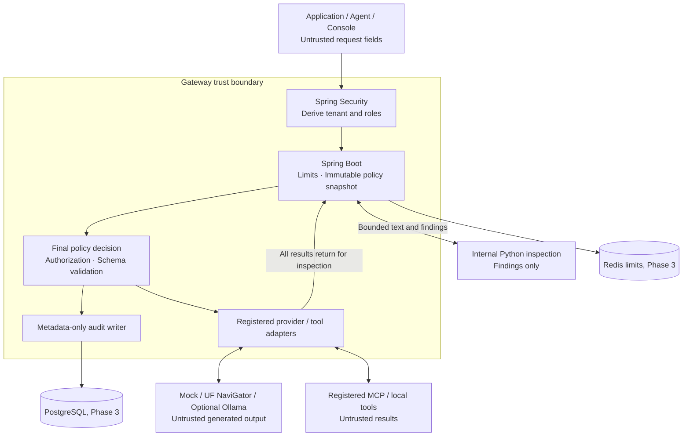

# Architecture and trust boundaries

## Deployment and ownership

Phase 1 runs one Java process and one Python process with mock/provider adapters. Policy, authentication, and registry modules stay in the Java service. The UI arrives progressively; metrics/databases are added at their specified phases.

## Boundaries

| Boundary | Rule |
|---|---|
| Client → gateway | Bearer application credential maps to trusted tenant, roles, provider/model allowlist, policy snapshot |
| Gateway → inspection | Internal authenticated service connection; no model execution or permission authority in Python |
| Gateway → model | Fixed server-configured destination, TLS verification, provider key injected server-side |
| Gateway → tool | Registered namespaced destination, pinned schema, resource checks, authorized call only |
| Model/tool → gateway | Parse within limits, inspect as untrusted output, validate before release |
| Console → management | Separate permissions, tenant scoping, versioned updates |
| Gateway → audit | Metadata-only records; no request bodies, credentials, matched text, or prompt hashes |

Client-supplied system messages are inspected content. They cannot set application identity, disable policy, or promote retrieved context into an authorization instruction. Conversation/tool history is untrusted input; a historical role label is not proof that an operation was authorized.

## Request pipeline

1. Authenticate and assign a server-generated operation ID. Strip/ignore client identity headers; never relay the application's credential upstream.
2. Enforce limits before allocation/expensive processing. Parse the supported subset, reject unknown fields, select a trusted policy snapshot and allowlisted model.
3. Acquire rate/concurrency capacity. Inspection previews consume capacity too.
4. Extract segments with paths and original text. Inspect messages and RAG chunks separately, then inspect the exact assembled provider-bound messages.
5. Validate findings against the contract and segment boundaries. Apply deny-first policy; validate redaction spans against UTF-8 boundaries.
6. Persist the pre-operation decision; call the fixed adapter with sanitized content only. The Phase 1 JSONL profile has local write-before-forward behavior, not transactional durability.
7. Bound and validate the provider response. Inspect every releasable text field and proposed function arguments. Malformed or uninspectable output is blocked.
8. Apply output policy/schema checks. Record outcome before releasing approved output in the durable profile.
9. Return the supported chat shape and decision metadata. Any blocked output response omits model content.

RAG chunks are assembled as explicitly delimited untrusted data in a user message, not elevated into the system prompt. Enforce message-count and text/byte bounds on the assembled payload too; reject assembly that exceeds limits. Delimiters are context organization, not an injection defense. The exact final payload is inspected again.

## Cross-language text locations

Use half-open UTF-8 byte offsets `[start_byte, end_byte)` into the exact segment's original text. Python computes byte locations; Java maps them back safely. Do not use Python character indices or Java UTF-16 indices interchangeably. Validate segment IDs, lengths, offsets, and code-point boundaries; fail closed on invalid findings. Normalized matching must retain an original-text mapping; otherwise the detector may deny but must not propose redaction spans.

## Tool enforcement

Discovery returns only authorized registered tool definitions. Tool descriptions/annotations from a server are scanned untrusted metadata, not authority. Registry schema changes require an operator-approved version update. Caller-supplied schemas or arbitrary URLs are rejected.

`/api/v1/tools/execute` resolves an approved tool, validates arguments, inspects them, and invokes a registered executor. Chat completions can emit permitted proposed calls, but a proposal does not execute anything. The execution endpoint re-authorizes against the current snapshot; it never trusts an old preview decision as a capability token.

Phase 2 MCP uses a maintained client SDK for a registered Streamable HTTP server. Initialization/version negotiation, sessions, `tools/list`, and `tools/call` are required. Text-only results are inspected; unsupported content is rejected. Sampling, elicitation, resources/prompts, tasks, batch requests, and arbitrary method forwarding are deferred. Pin the SDK/spec and confirm server compatibility in Phase 2.

## Failures and idempotency

- Inspector timeout/invalid response: 503; no upstream call/input forwarding or output release.
- Upstream timeout: 504; no automatic generation fallback/retry, preserving budget and policy semantics.
- Upstream permission/transport/malformed response: sanitized 502; upstream details stay out of client/log output.
- Redis failure in shared-limit mode: 503. Local development limiter is single-process only.
- Required pre-operation audit failure: 503 and no execution.
- Post-execution tool failure or audit failure: operation may have executed; report a sanitized uncertain outcome, retain correlation, never retry automatically.
- Invalid policy update: reject atomically; keep validated snapshot. In Phase 3 define freshness at activation; stale mandatory configuration denies.

Read-only tools are the initial target. Do not claim exactly-once execution. A durable operation ID and explicit idempotency protocol are prerequisites for adding side-effecting tools.

## Local deployment

Expose the gateway and console on loopback. Python, database, Redis, and demo tools use internal networking. Provider TLS verification stays enabled. Local plaintext container-network calls are a development assumption; production TLS/mTLS is deferred.

In Phase 7, kind bootstraps the cluster and Terraform owns the project workloads inside it. Use a policy-capable networking setup before claiming NetworkPolicy enforcement. Check state/secret exclusions; do not store usable provider credentials in Terraform examples.
