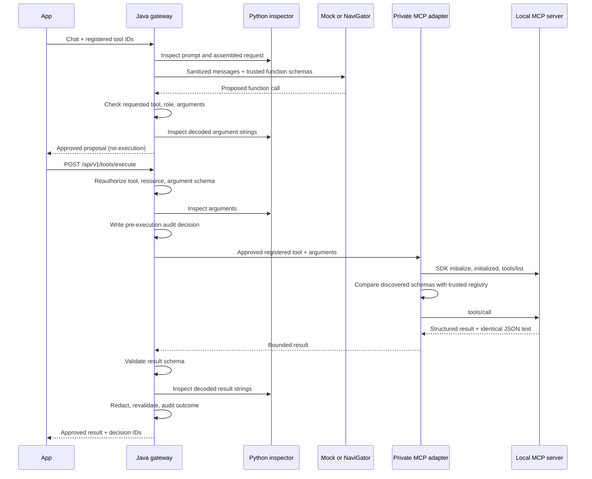

# Phase 2 — Agent, schema, and MCP enforcement

[Phase 3](../phase-3/README.md) now supplies persistent PostgreSQL state, shared Redis admission, and management APIs. Local-file/process-only descriptions below record this earlier baseline.

The Java gateway now validates model tool proposals and independently authorizes tool execution. It also enforces a registered JSON output schema. Docker Compose adds a private Python MCP SDK adapter and a read-only demonstration server. Generation defaults to mock mode; this phase needs no hosted model calls or paid infrastructure.

## Run the demonstration

```sh
python3 tools/setup_dev.py
docker compose up -d --build --wait
python3 tools/demo_phase2.py
```

Setup preserves existing credentials and adds a separate MCP service credential to an older `.env`. Do not source `.env` as a shell script. The gateway remains on `127.0.0.1:8080`; inspection and MCP adapter ports are private to Compose. The MCP endpoint itself accepts only authenticated loopback requests inside its container. Development credentials are excluded from image builds.

The demo shows discovery, a model tool proposal, an independently authorized execution through MCP, deletion denial, resource restriction, PII argument denial, role spoof rejection, and validated structured JSON. The original `python3 tools/demo.py` content-security demonstration still works. These are synthetic, read-only fixtures; no ticket system or real knowledge base is contacted.

## Enforcement flow



### Public API additions

- `GET /api/v1/tools`: returns only tools allowed for the authenticated application, reviewed schemas, and the registry version. Viewer/operator roles receive an empty list.
- `POST /api/v1/tools/execute`: accepts exactly `tool_id` and `arguments`. Authority is derived from the application's authenticated tenant and roles. Unknown tools deny by default.
- Chat `sentinel.tool_ids`: opt into registered tools. Client-supplied `tools`, arbitrary schemas, URLs, and role overrides remain unsupported. Model proposals must belong to this request's approved set and pass role, schema, and argument-content checks. They are never executed automatically.
- Chat `sentinel.output_schema_id`: request the registered `support-answer-v1` schema. The gateway sends its trusted schema to the provider, then strictly parses, validates, inspects, redacts, and revalidates the model's JSON before release. Invalid, duplicate-key, truncated, or schema-mismatched output fails closed. Tool proposals and structured output cannot be requested together in this phase.

Provider function aliases are `kb_search` and `ticket_get`, which fit common provider naming restrictions. The gateway maps them back to public/MCP IDs `kb.search` and `ticket.get` after validation. Returned proposals use those public IDs so the application can submit an execution request directly.

### Registered read-only resources

`kb.search` accepts a bounded `query` and returns static demo documentation. `ticket.get` accepts only IDs matching `DEMO-[0-9]{1,6}` and returns a synthetic ticket. Unknown fields, URL arguments, and non-demo ticket IDs fail validation. `ticket.delete` has no implementation or registration.

The trusted registry is packaged from `policies/examples/tool-registry-v1.json`; policy permissions come from the gateway's validated startup snapshot. MCP descriptions, instructions, annotations, links, and claimed read-only flags grant no permission. Discovered schemas must match the reviewed catalogue before calling. Registry schemas are closed, use a restricted vocabulary, reject references, and allow only reviewed identifier patterns.

PII in tool arguments is blocked rather than rewritten, because rewriting can change which resource an operation accesses. Result strings may be redacted; the result must still satisfy its schema afterward. String values are decoded and inspected individually, which prevents JSON Unicode escapes from hiding content. Schema property names are fixed by the reviewed closed catalogue.

## Supported MCP subset

The adapter uses the official Python MCP SDK, pinned to `mcp==2.2.0`. It uses the legacy initialization handshake and requires negotiated protocol `2025-11-25` over stateful Streamable HTTP. Each execution opens a new session, performs initialization and tool discovery, calls one tool, and closes the session. The endpoint is fixed to `http://127.0.0.1:8100/mcp` inside the adapter container.

The supported flow is initialization, initialized notification, `tools/list`, `tools/call`, SDK ping/session cleanup, and HTTP session deletion. Discovery is unpaginated and pinned to the two registered tools. Results must contain an object `structuredContent` and exactly one text block containing the identical JSON value. Error results, schema drift, non-text content, ambiguous content, additional capabilities, and nonempty server instructions are rejected.

The demonstration uses JSON responses, not SSE streams. It does not support arbitrary remote MCP servers, OAuth, stdio subprocesses, resources, prompts, sampling, elicitation, roots, tasks, multimodal content, or autonomous multi-turn tool history. The custom public execution endpoint is not a full MCP server. A complete agent conversation loop and console belong to later work.

HTTP responses are capped at 64 KiB; proxy inheritance, redirects, and transport retries are disabled. The adapter has a four-second total deadline, and Java applies a five-second deadline and four concurrent executions. Java shares the existing application request quota across chat, preview, and execution. Unknown execution outcomes return HTTP 503 `OUTCOME_UNCERTAIN`, are audited as `uncertain`, and are not retried automatically.

## Verification

For native development, install the inspection dependencies as described in the Phase 1 guide, then add:

```sh
python3 -m venv services/mcp-adapter/.venv
services/mcp-adapter/.venv/bin/pip install -r services/mcp-adapter/requirements-dev.lock
tools/check.sh
SENTINEL_COMPOSE_TESTS=1 services/inspection/.venv/bin/python -m pytest -q tests/integration
```

Port 8100 must be free on the host for isolated MCP transport tests. Compose does not publish that port. The integration checks restart local services and temporarily override synthetic responses; they restore normal mock configuration afterward. Run them against this project's development stack.

`SENTINEL_DEMO_TOOL_TEXT` is a test-only fixture override for the local knowledge-base result. Tests use it to prove that real MCP results are inspected and redacted or blocked. `SENTINEL_MOCK_RESPONSE` similarly supports model-output failure fixtures. Neither is a configurable user operation.

Native gateway development defaults to in-process read-only fixtures. Compose sets `SENTINEL_TOOL_MODE=mcp`; this requires a private `SENTINEL_MCP_KEY` and registered `SENTINEL_MCP_BRIDGE_URL`. Keys and raw arguments/results never appear in the gateway audit. Metadata includes operation/decision IDs, policy version, tool ID where known, rule IDs, reason codes, and outcome.

See [verification results](verification.md) for measured checks and limits. Demo execution counters are process-local and reset on restart.

## Limits and next phase

This is a constrained local security prototype. Detection remains deterministic regex rules; it is not a comprehensive jailbreak defense. The local audit remains a single-process JSONL file, and limits remain in memory. Remote server onboarding, production resource authorization, durable operation reconciliation, and safe handling of side effects require further design. This phase does not implement mutating tools.

Phase 3 adds PostgreSQL for durable policy/event state, Redis for shared atomic limits, tenant-scoped event queries, and protected management APIs. That provides the backend needed for the Phase 4 React console.

Implementation references: [official MCP SDK documentation](https://py.sdk.modelcontextprotocol.io/), [MCP lifecycle](https://modelcontextprotocol.io/specification/2025-11-25/basic/lifecycle), and [Streamable HTTP transport](https://modelcontextprotocol.io/specification/2025-11-25/basic/transports).
