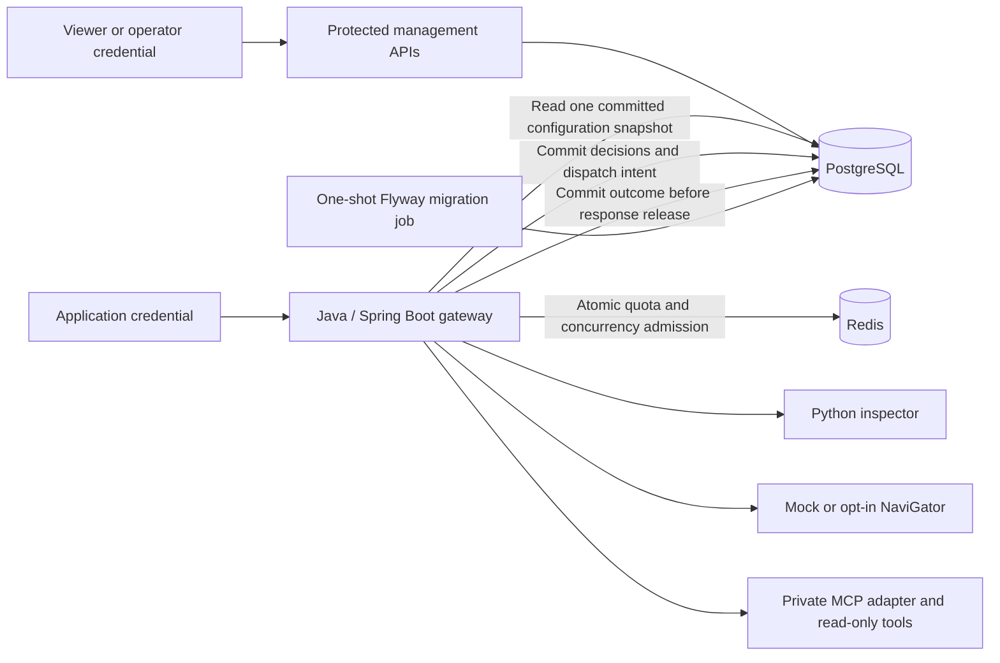

# Phase 3 — Shared state and durable audit

The default Compose stack now uses PostgreSQL for versioned policy/registry snapshots, security events, and operation outcomes, and Redis for shared quotas and concurrency admission. Protected management APIs provide the data needed for the Phase 4 console. All services run locally; mock generation remains the default.

## Run it

```sh
python3 tools/setup_dev.py
docker compose up -d --build --wait
python3 tools/demo_phase3.py
```

Setup preserves existing credentials and provider settings, adds separate database/Redis credentials and management identities, and keeps `.env` private with mode `0600`. No credentials are displayed. An existing mock configuration stays in mock mode. Do not source `.env` as a shell script or commit filled credentials.

The gateway remains at `127.0.0.1:8080`. PostgreSQL, Redis, inspection, and the MCP adapter have no published host ports. A one-shot migration job applies Flyway migrations before the gateway starts. Its database-owner credential is absent from the gateway's runtime environment. The runtime connects as `sentinel_app`.

Persistent volumes retain PostgreSQL data and Redis AOF data. The older JSONL audit volume is retained for historical Phase 1/2 records; persistent mode writes new events exclusively to PostgreSQL. Existing JSONL records are not automatically imported. Avoid `docker compose down -v` if you want to keep your local history.

The demo proves management authorization, tenant isolation, durable traces, a policy change from email redaction to denial, stale-revision rejection, and version history. It restores the original rules as a new revision. Run it against the default synthetic email-redaction policy, with no concurrent policy editor. The original content and tool demos also remain available:

```sh
python3 tools/demo.py
python3 tools/demo_phase2.py
```

## Architecture



### Configuration snapshots

Each tenant has one active revision, referencing an immutable policy and registry pair. Every work request reads that pair once. All inspections, role checks, model/tool checks, decisions, and operation metadata use that snapshot until the request finishes. Updating a policy affects subsequently admitted requests; it does not retroactively revoke a running request.

Configuration activation locks the tenant's head row, compares `expected_revision`, inserts the next policy/registry revision, changes the active pointer, and records the authenticated actor in one database transaction. Two updates against the same revision have exactly one winner; the other returns HTTP 409 `VERSION_CONFLICT`. Reverting rules creates another revision and preserves history.

Both `policy.version` and `registry.version` must equal the next revision. The policy tenant and policy ID cannot be changed. Registry changes may enable or disable packaged, reviewed tool/output definitions. Input/output schemas, executor bindings, and new remote servers cannot be introduced through this API. Removing a tool also requires removing its policy permissions in the same update. This keeps the Phase 2 MCP catalogue pinning and resource constraints intact.

### Tenant and role boundaries

Application keys still map to trusted identities in server configuration; bodies and query strings cannot choose their tenant or management role. Policies contain tool permissions, not management credential grants.

- `support_agent`: application chat, inspection, and explicitly permitted tools; no management access.
- `viewer`: read its tenant's configuration, history, events, and traces; no configuration updates.
- `operator`: read and update its tenant's configuration. Management privileges alone do not grant tool permissions.

Setup creates a primary demo tenant and a second synthetic tenant for isolation checks, with separate credentials. The operator/viewer credentials are local backend credentials; the browser-console authentication design belongs to Phase 4.

Repository queries include an explicit tenant predicate, and every database transaction sets a transaction-local tenant context for PostgreSQL row-level security. The runtime role is not a superuser or table owner. It can append configuration versions, management-change records, and audit events, but cannot update/delete those records. It can update operation state and the active configuration pointer. Database/migration administrators remain trusted; this is not a cryptographically tamper-proof log.

### Durable work lifecycle

1. Read a validated policy/registry snapshot and create an operation record.
2. Check the Redis quota, inspect content, and persist approval/denial decisions.
3. Before a model or tool call, commit dispatch intent with status `in_flight`.
4. Once a response returns, persist `external_state=returned` before validating or releasing it.
5. Inspect and validate the output, persist its decision, and commit the final operation outcome before returning a successful response.

No database transaction is held open while waiting for a model, inspection service, or tool. Event payloads contain whitelisted metadata only: IDs, tenant/application, policy and registry versions, stage, action, rule/reason codes, duration, and outcome. Prompts, arguments, tool/model results, matched text, and credentials are not stored.

Operations distinguish `started`, `in_flight`, `completed`, `blocked`, `failed`, and `uncertain`, with external-state metadata and a fixed public error code where available. A deadline-expired abandoned dispatch is presented as uncertain, while its original stored status remains visible. These records are never automatically reexecuted. A missing final database acknowledgement withholds the response; the committed state may later need to be checked through the trace API. Operation IDs are server-generated, and this phase does not promise request idempotency or exactly-once external execution.

### Shared admission

Redis Lua scripts use the Redis server clock for fixed-window quotas and concurrency leases. Quota keys are scoped by tenant, application, and purpose; key rotation or a configuration revision does not reset the count. Changing the configured window duration changes the window namespace. Discovery and management have separate fixed quotas of 100 requests per 60 seconds so an application-work quota cannot prevent policy recovery.

Chat concurrency leases are shared per tenant and honor its snapshot's `max_concurrent_provider_calls`; tool execution has a shared ceiling of four. Local ceilings remain two chat calls, four tool calls, and eight inspector calls per gateway process. Leases expire after a conservative deadline budget, and cleanup failures do not retry external work. Policies specify admission ceilings, not guaranteed throughput. A paused process can outlive a lease; this is not distributed execution fencing.

Redis uses AOF with `appendfsync always` and `noeviction` to avoid silently discarding active counters under memory pressure. Loss/restoration of Redis data can reset admission state; production recovery guarantees need further work.

## Management API

All routes below require `Authorization: Bearer <management credential>` and derive the tenant from that credential.

| Endpoint | Purpose |
|---|---|
| `GET /api/v1/management/config` | Active `{revision, policy, registry}` |
| `PUT /api/v1/management/config` | Activate `{expected_revision, policy, registry}`; operator only |
| `GET /api/v1/management/config/history` | Immutable revisions with actor and timestamp |
| `GET /api/v1/management/events` | Sanitized security-event pages |
| `GET /api/v1/management/operations/{uuid}` | Operation metadata and its event trace |

History and events use `limit` (1–100, default 50) and an exclusive `before` cursor returned as `next_cursor`. Events additionally accept `action`, `stage`, and `operation_id`. Unknown/duplicate query parameters are rejected. Responses are capped at 512 KiB; choose a smaller page for unusually large configurations. Cross-tenant and unknown operation IDs both return HTTP 404 `NOT_FOUND`.

A policy-update example is available at `contracts/examples/config-update.json`. Fetch the current configuration first, use its revision as `expected_revision`, and increment both version fields. Live edits should use that fetched tenant policy rather than hardcoding the example's tenant/revision.

`GET /health/live` is process liveness. `GET /health/ready` checks Redis and a validated database snapshot in persistent mode. Neither returns credentials or configuration. Readiness does not claim that a hosted model or the inspector is currently usable; protected requests check those dependencies separately.

## Failure behavior

| Failure | Behavior |
|---|---|
| PostgreSQL unavailable | HTTP 503; no stale snapshot or file fallback; no model/tool dispatch without durable intent |
| Redis unavailable or out of memory | HTTP 503; no local limiter fallback or new external work |
| Quota/concurrency limit reached | HTTP 429; no new external dispatch |
| Inspection unavailable/partial | Fail closed before execution or output release |
| Model/tool response unsupported | Withhold result and record failure where the database is available |
| MCP outcome unknown | HTTP 503 `OUTCOME_UNCERTAIN`; no automatic retry |
| Durable output/outcome write fails | Withhold successful output; retain pending/uncertain evidence if it was previously committed |

Metadata cannot be persisted while PostgreSQL itself is unavailable. The response still fails closed; there is no raw-payload or alternate audit sink. Durability is subject to the local database volume and storage environment, not replication or disaster recovery guarantees.

## Test and development commands

```sh
tools/check.sh
python3 tools/check_state.py
SENTINEL_COMPOSE_TESTS=1 services/inspection/.venv/bin/python -m pytest -q tests/integration
```

`check_state.py` creates disposable PostgreSQL/Redis containers with private, generated test credentials and temporary loopback ports. It runs Java tests against the restricted application role and removes those containers afterward. It does not read production credentials or touch the project's database volume. Default native unit checks need no database or model traffic.

Compose integration checks restart local services and temporarily change synthetic policies/responses, then restore them. Run them against this development stack, with no concurrent demo/editor. Shared quotas survive gateway restarts, so repeated manual tests can hit a legitimate HTTP 429 until the window expires.

Native gateway mode defaults to the earlier single-tenant `memory` mode for lightweight tests: file audit and process-local admission, with management APIs unavailable. It is a separate development mode, never an outage fallback. Persistent mode is selected explicitly with `SENTINEL_STATE_MODE=postgres`, database app credentials/URL, and Redis host/password. Use management revisions for persistent policies; `SENTINEL_POLICY_PATH` is accepted only in memory mode.

See [verification results](verification.md) for measured checks. Phase 4 will add the React/TypeScript console and support-agent experience on these APIs.

Implementation references: [PostgreSQL row security](https://www.postgresql.org/docs/17/ddl-rowsecurity.html), [Redis atomic counter pattern](https://redis.io/docs/latest/commands/incr/), and [Flyway PostgreSQL support](https://documentation.red-gate.com/flyway/reference/database-driver-reference/postgresql-database).
