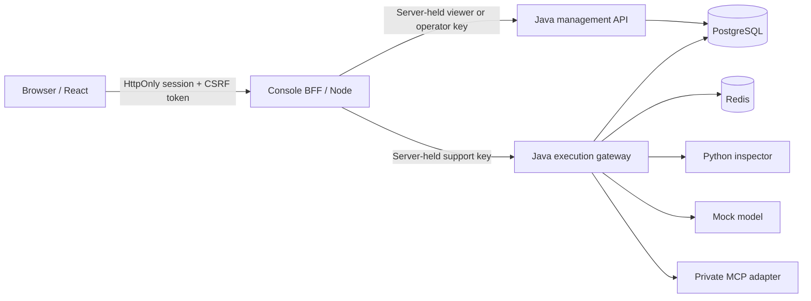

# Phase 4 — Security console and guarded agent demo

The React/TypeScript console is served by a small Node.js backend for frontend (BFF). Java/Spring Boot remains the policy and execution authority. PostgreSQL holds policy revisions and metadata; Redis enforces gateway admission. No hosted model calls are required.

## Start and sign in

```sh
python3 tools/setup_dev.py
docker compose up -d --build --wait
python3 tools/console_login.py --account operator
```

Open **http://127.0.0.1:3000**, select Operator, and paste the password copied by the helper. Use `--account viewer` for the read-only account. The helper copies only the console password, never a gateway key, and does not print it. Clear the clipboard after login (`printf '' | pbcopy`). On other operating systems, retrieve the matching `SENTINEL_CONSOLE_OPERATOR_PASSWORD` or `SENTINEL_CONSOLE_VIEWER_PASSWORD` privately from `.env`.

Use the exact `127.0.0.1` URL, rather than `localhost`: the server checks Host and Origin against its configured origin. To change the port, set `SENTINEL_CONSOLE_PORT` in `.env` and recreate the console. Keep `SENTINEL_PROVIDER=mock` for free, repeatable demonstrations.

The console binds only to loopback. Database, Redis, inspector, and MCP remain private to Compose. Existing state is preserved across startup and rebuilds.

## Five-minute demonstration

1. **Overview:** Seed demo evidence. Four synthetic previews create real audit events; the cards summarize the latest 50 events, not all-time request totals. Show readiness and the active revision.
2. **Playground:** Choose Prompt injection, preview its findings, then run an enforced request. Open its operation trace and show that execution was blocked. Choose PII exposure to inspect redaction; choose Poisoned retrieval to show RAG denial. Preview returns a decision without invoking a model.
3. **Tool boundary:** Choose Forbidden tool and attempt `ticket.delete`. The gateway rejects this unregistered tool. The operation trace records whether an external dispatch occurred.
4. **Policies:** Change PII/prompt from redact to deny and publish a new revision. Repeat the PII preview to see enforcement change. Restore demo defaults to append a reviewed configuration revision. Existing history is retained.
5. **Support agent:** Run the guarded password-support workflow. Three independent gateway operations validate a model proposal, reauthorize and execute `kb.search` through MCP, then inspect retrieved content and validate the structured answer. Open each operation's trace.
6. **Events:** Filter by action, boundary, or operation UUID; load older events. Sign in as Viewer to demonstrate server-enforced read-only access.

Quotas are real: the default support identity allows 30 operations per 60 seconds, shared with CLI demos. Wait for the window after repeated runs. The support workflow consumes three operations; preview seeding consumes four. Publishing a policy does not reset this quota.

## Trust boundaries



The browser receives a random expiring session cookie and CSRF token, not API keys. Operator and viewer passwords are separately generated, compared against scrypt hashes, and never included in frontend build variables. The browser stores no credentials in localStorage/sessionStorage. The BFF chooses gateway identity from the authenticated server session. Viewer writes and execution routes return 403 even if called directly.

Sessions last 30 minutes without sliding extension. Restarting the console invalidates all sessions. Login permits ten attempts per minute across this single local instance, with at most 64 active sessions. Authenticated requests have a per-session limit and bounded concurrency. Host/Origin checks, SameSite=Strict, CSRF tokens, CSP, no-store responses, bounded bodies, fixed upstream routes, sanitized errors, and no redirects constrain the BFF boundary.

The HTTP loopback cookie is HttpOnly/SameSite; Secure is enabled for an HTTPS origin. This local login is not a production identity platform: public deployment needs TLS, identity integration, distributed sessions/abuse controls, and deployment review. There is intentionally no public exposure in Compose.

## What the demo does and does not prove

Every displayed decision comes from the existing gateway. Synthetic text and results live in page memory; the audit feed contains metadata only. The console does not add raw-payload retention. React escapes displayed text; content is never rendered as HTML.

Console generation/tool/seed/support demos refuse hosted-provider mode. Preview remains available because it uses the local inspector. Existing authorized backend clients can still use the separately configured NaviGator adapter; no live calls were made in Phase 4.

The workflow is bounded and read-only, and stops on a rejected boundary. It uses an explicit server controller, not a general autonomous agent loop. The model's tool proposal is independently validated and executed by a separate gateway request. Successful tool documents re-enter the inspected RAG boundary before final generation. Mock output is demonstrative, not evidence of model reasoning quality or general prompt-injection detection accuracy.

Policy editing covers detector actions, support-tool permissions, and selected quotas. Registered schemas/executor definitions stay reviewed and pinned by the backend. Restore defaults appends a new revision and does not delete events or bypass concurrency checks.

## Development and checks

Node 22.12+ is required by the frontend toolchain; the container uses Node 24. React 19.3, Vite 8.3.1, TypeScript 7.0.2, and Playwright 1.63.0 are pinned in the npm lockfile. See [React versions](https://react.dev/versions) and [Vite requirements](https://vite.dev/guide/).

```sh
cd services/console
npm ci
npm run build
npm test
npx playwright install chromium
npm run test:e2e
```

Browser tests require the healthy Compose stack and mock provider. They use private credentials internally, disable traces/video, write screenshots containing synthetic data and metadata, and restore original policy semantics as a new revision after testing policy changes. Do not run state-mutating integration suites or Compose rebuilds concurrently. Allow the default 60-second support quota window to recover after a long demo before starting backend integration tests. To use a different console port for tests, set `SENTINEL_CONSOLE_TEST_URL` to the exact configured origin.

For native BFF development, export only the console settings/private keys using your own environment loader; `node server.mjs` serves the built `dist` directory. Do not source the unquoted JSON in `.env` as a shell script. Docker is the documented default workflow.

[Verification results](verification.md) · [Overview screenshot](overview.png) · [Agent screenshot](support-agent.png) · [Policy screenshot](policies.png)

Equivalent authenticated CLI actions:

```sh
python3 tools/demo_phase4.py          # Guarded three-step support workflow
python3 tools/demo_phase4.py --seed   # Append four synthetic previews
python3 tools/demo_phase4.py --reset  # Append demo defaults; retain history
```
