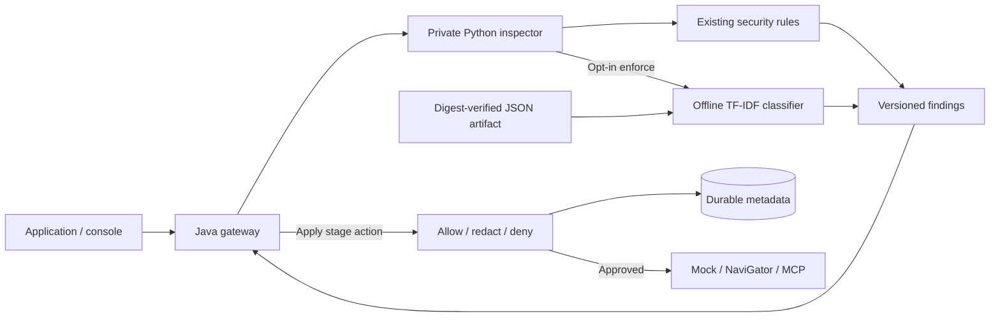

# Phase 5 — Local classification and measured evaluation

Phase 5 adds a small local ML classifier to the Python inspector, a reproducible training/calibration/evaluation pipeline, corpus provenance, a versioned JSON model and a published report. Java remains the security policy and execution authority. Inference needs no GPU, pretrained model download, hosted call, or additional production dependency.

**ML is off by default.** The held-out public corpus gives 70% recall and zero observed false positives on 56 benign examples, but a separate synthetic challenge flags six of 16 benign cases. This is an experimental lexical baseline with measured limitations, not a production-ready detector. [Read the full evaluation](evaluation-v1.md) before enabling it.

## Run locally

```sh
python3 tools/setup_dev.py
docker compose up -d --build --wait
python3 tools/demo_phase5.py
```

The default rule-only preview allows the synthetic authority-spoof example because it matches none of the existing explicit rules. This is a useful comparison, not an assertion that the text is safe.

Temporarily enable the packaged classifier:

```sh
SENTINEL_CLASSIFIER_MODE=enforce docker compose up -d --wait inspection gateway
python3 tools/demo_phase5.py
```

Now the preview returns a scored `ML.PROMPT_INJECTION` finding spanning the whole original UTF-8 segment. Java applies the current stage's prompt_injection action; the reviewed default policy denies it. Preview never executes a model or MCP tool.

Restore the default explicitly:

```sh
SENTINEL_CLASSIFIER_MODE=off docker compose up -d --wait inspection gateway
```

For persistent opt-in behavior, change `SENTINEL_CLASSIFIER_MODE` in private `.env` to `enforce` and recreate inspection. Use `off` to restore rule-only behavior. The existing rule detectors remain active in both modes. Invalid mode, corrupt model or inference failure prevents successful inspection; there is no silent fallback from configured enforcement.

The console's Playground includes **Authority spoof (ML)**. Preview it in each mode to compare decisions and inspect scores. Events and operation traces retain detector IDs/versions; scored findings appear in inspection responses without storing prompt bodies. The 30-per-minute shared support quota still applies.

## Architecture



The classifier implements a small `Classifier` protocol. Its first implementation uses word unigrams/bigrams, sublinear term frequency, smooth IDF, L2 normalization, balanced logistic regression and sigmoid calibration. Production inference is standard-library Python. No pickle, joblib or remote model loading is used.

The packaged artifact is 118,087 bytes with 1,602 features. Its SHA-256 is pinned in the manifest and included in the runtime detector version, so changing weights or threshold produces distinguishable findings. Model loading validates bounded JSON, algorithm/version/category, vocabulary, finite parameters, threshold and integrity. Custom reviewed JSON artifacts require both `SENTINEL_CLASSIFIER_PATH` and `SENTINEL_CLASSIFIER_SHA256`; mount them explicitly in your own deployment configuration.

ML detects one binary category: prompt injection. Jailbreak, secret and PII rules remain independent. Negative ML scores never suppress rules. The classifier cannot localize malicious words, so positive findings conservatively span the whole segment; a configured redact action removes that whole segment. Scores are corpus-calibrated estimates and do not establish intent or universal protection.

## Reproduce training and evaluation

Core tests and Docker inference are offline and use the committed artifact. Training dependencies are isolated in a separate environment; the small public corpus is downloaded only with an explicit command.

```sh
python3 -m venv evaluation/.venv
evaluation/.venv/bin/python -m pip install -r evaluation/requirements.lock
evaluation/.venv/bin/python evaluation/prepare_corpus.py --download
# Subsequent verification is offline:
evaluation/.venv/bin/python evaluation/prepare_corpus.py
evaluation/.venv/bin/python evaluation/train_classifier.py
evaluation/.venv/bin/python evaluation/evaluate_classifier.py
evaluation/.venv/bin/python -m pytest evaluation/tests -q
```

The immutable corpus revision and original checksums are committed. Raw parquet cache is ignored and excluded from Docker. [Corpus documentation](../../evaluation/data/README.md) retains the source's sparse annotation information and conflicting Apache-2.0 / nested CC-BY-4.0 license metadata, with attribution and both license texts.

Split protocol:

| Partition | Rows | Purpose |
|---|---:|---|
| Fit | 328 | Learn vocabulary, IDF and logistic coefficients |
| Calibration | 109 | Fit sigmoid probability calibration |
| Threshold development | 109 | Select the fixed operating threshold |
| Official held-out | 116 | Frozen final accuracy report |
| Engineering challenge | 32 | Separate diagnostic examples; no fitting or selection |

Normalized exact and measured near-duplicate families are kept disjoint; training rows overlapping official test families would be excluded. No exclusions occurred in v1. The fixed threshold is 0.78, selected under an **observed development** FPR budget of 5%. The model family/hyperparameters were fixed before held-out evaluation. Reproduction with the same locked environment yielded byte-identical model weights; floating-point differences on other platforms require review of a new artifact.

The evaluation writes [machine-readable results](../../evaluation/reports/phase5-v1.json), with confusion matrices, probability metrics, uncertainty, per-row identifiers/scores, known misses, and local latency measurements. [Readable report](evaluation-v1.md) explains interpretation. Never tune against this published held-out set and claim it is still unseen; future model revisions need fresh evaluation data or an appropriate nested validation protocol.

## Verification

```sh
tools/check.sh
# Shared Docker mutation tests must run sequentially, separate from rebuilds/UI demos:
SENTINEL_COMPOSE_TESTS=1 services/inspection/.venv/bin/python -m pytest tests/integration -q
npm --prefix services/console run test:e2e
```

The integration suite temporarily enables ML, checks prompt/RAG/tool/output enforcement, and restores rule-only mock services. Existing permission, persistence, outage and tool/schema checks remain in the suite. See [verification results](verification.md).

Generation remains separate from classification. The existing backend-only NaviGator adapter can be enabled through the Phase 1 instructions after account/budget checks; it was not called here. Optional Ollama generation is deferred, so there is no large model download or additional laptop resource requirement for this phase.

Next: Phase 6 adds Prometheus/Grafana, end-to-end reliability measurements, load tests, and performance reporting.
