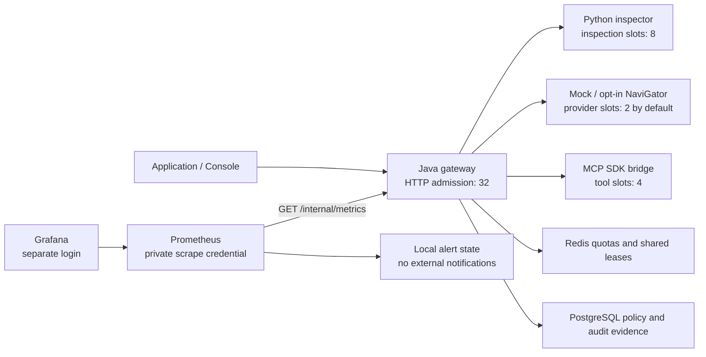

# Phase 6 — Observability, reliability and measured performance

Phase 6 adds authenticated Prometheus metrics, provisioned Grafana dashboards and local alert rules, a bounded HTTP admission gate, graceful shutdown, interrupted HTTP-call cancellation, repeatable mock-only load tests and real dependency-failure exercises. No paid services are required.

## Run the monitoring demo

From the repository root:

```sh
python3 tools/setup_dev.py
python3 tools/setup_monitoring.py
docker compose --profile monitoring up -d --build --wait
```

The existing console remains at <http://127.0.0.1:3000>. Grafana is at <http://127.0.0.1:3001/d/sentinel-overview> (user `admin`). Its password is stored privately in `.env` as `SENTINEL_GRAFANA_PASSWORD`; `python3 tools/monitoring_login.py` copies only that password to the macOS clipboard. Prometheus targets and alerts are visible at <http://127.0.0.1:9090/targets> and <http://127.0.0.1:9090/alerts>. Open **SentinelLLM — Security and Reliability** in Grafana, generate synthetic evidence in the console, then run the load test to populate charts.

Monitoring is an optional Compose profile. To stop only monitoring:

```sh
docker compose --profile monitoring stop prometheus grafana
```

Monitoring pins Prometheus 3.13.3 LTS and Grafana OSS 13.2.3, checked against the [Prometheus downloads](https://prometheus.io/download/) and [Grafana downloads](https://grafana.com/grafana/download) on October 1, 2026. Monitoring has bounded memory (Prometheus 256 MiB; Grafana 768 MiB with a 256-MiB Go memory target), 24-hour/256-MB Prometheus retention, and no external notification receiver or Grafana plugin download. Alert state remains local. Thresholds are demonstration settings, not measured production SLOs. The Prometheus UI is loopback-only and unauthenticated; it exposes aggregate local operational data. Grafana requires its separate password. Do not publish these ports or reuse this development HTTP setup as a public deployment.

## Architecture



The Java gateway owns the metrics registry. Timers around **each dependency invocation** separate inspection, provider, tools, audit persistence, state transactions and Redis checks/lease acquisition. HTTP timers cover authenticated requests through response rendering and also record fixed categories for errors, denials and limiting. No raw URI, identity, prompt, response, secret, operation ID, tool argument, detector version or exception message is a metric label. Only finite route, result, stage, action and dependency labels are used. `/internal/metrics` requires an independent monitoring credential that cannot execute application or management requests; application and operator keys cannot scrape it. Scraping does not consume work quota or HTTP admission slots. Liveness/readiness remain available under application admission pressure.

Security decisions count only after successful audit persistence. Dependency results distinguish policy/quota rejection from dependency failure. The dashboard includes p50/p95/p99 HTTP latency, dependency p95, outcomes, security actions, admitted requests, JVM memory, process CPU, dependency failures, availability and firing alerts. JVM CPU is process utilization, not total host CPU. Prometheus histograms estimate quantiles; the benchmark reports nearest-rank client percentiles independently.

## Reproduce benchmarks

```sh
python3 tools/load_test.py --requests 100 --concurrency 1 2 8 --output runtime/phase6-load.json
```

This command requires both configured and running gateway provider mode to be `mock`. It uses a **separate benchmark tenant** with synthetic content, temporarily raises only that tenant's rate budget to 1,000 requests per second, preserves security actions and concurrency limits, and restores its previous policy as a new audited revision in `finally`. The primary demo policy is untouched. It runs preview, chat and MCP-tool workloads with five warm-ups per workload/concurrency pair. Workload size and concurrency are capped. No output payloads or credentials are written to the report.

The generator is a closed-loop thread pool using Python's standard-library HTTP client. Each request opens a client connection. The report includes attempted and successful throughput, status counts, p50/p95/p99 for all attempts and successes separately, dependency call counts/means, hardware/runtime versions, and Docker CPU/RAM samples. Rejections must not be counted as successful throughput. This is a local benchmark of one stack, not a Java-versus-Go comparison or production capacity claim.

Dependency sum deltas divided by attempts give amortized component time. **Unattributed client time** is the mean client latency minus measured dependency time per attempt. It includes Java validation/policy/serialization, scheduling, Redis lease release, transport and client overhead; it is not a pure isolated gateway CPU metric. Run on a quiet stack: unrelated requests and background readiness probes contaminate aggregate state/Redis metric deltas. Never subtract percentile values to estimate overhead. Mock provider timing measures deterministic fixture construction, not real model inference. Hosted model latency and cost were not tested. Preview and chat have different inspection counts, and rejected requests may never reach inspection/provider dispatch.

See [measured results](performance.md) for this machine's evidence.

## Reliability checks

```sh
./tools/check.sh
SENTINEL_COMPOSE_TESTS=1 services/inspection/.venv/bin/python -m pytest -q tests/integration/test_observability.py
```

Run Compose mutation tests and benchmarks **sequentially**. They operate on this project's local stack. The integration tests stop/restart inspection and Redis, temporarily revoke/restore the runtime database role's audit INSERT grant, introduce mock-only latency, overload the provider concurrency limit, send SIGTERM during a dispatched mock request, and check metadata recovery. The audit-failure exercise requires the development database owner and should not be run against another database. No events or policy histories are deleted. Inspection/Redis/audit failure checks compare provider dispatch counters before/after to verify that a failed request never invokes the provider.

The HTTP admission gate rejects excess authenticated requests before body parsing and downstream work. Existing inspection/provider/tool slots, Redis quotas/shared leases, database connection limits, payload limits and dependency deadlines remain enforced. Shutdown drains accepted requests for up to 90 seconds; Compose grants 100 seconds before forced termination. Operator-configured dependency budgets can exceed the drain window; keep those budgets aligned with shutdown configuration. Service DNS cache entries expire after five seconds (negative entries after one second), and Redis reconnects use a 500-ms delay, a two-second connect timeout, a 64-command queue and disabled command replay. Recovery checks issue new operations rather than retrying a dispatched operation. Interrupted outbound waits now cancel their pending HTTP future and preserve thread interrupt status; timed-out response bodies are also cancelled. There are no automatic retries of model/tool execution.

These controls do **not** provide a single end-to-end request deadline, request-body read deadline, or rollback of an already dispatched external call. HTTP client disconnect does not reliably interrupt a servlet worker. Process termination after dispatch can still produce an uncertain outcome. Expiring Redis leases are not fencing tokens for a paused process. Readiness checks PostgreSQL/Redis, while inspection/MCP failures are discovered on use. Prometheus scrape availability is not equivalent to dependency readiness. Horizontal admission is per process plus existing shared Redis execution controls; global HTTP admission and comprehensive circuit breaking remain future work.

## Sources

The implementation uses [Micrometer's Prometheus registry](https://docs.micrometer.io/micrometer/reference/implementations/prometheus.html), [Spring Boot graceful shutdown](https://docs.spring.io/spring-boot/reference/web/graceful-shutdown.html), [Prometheus file-based scrape authorization](https://prometheus.io/docs/prometheus/latest/configuration/configuration/), [Grafana provisioning](https://grafana.com/docs/grafana/latest/administration/provisioning/), and [Grafana file-based Docker credentials](https://grafana.com/docs/grafana/latest/setup-grafana/configure-docker/). These sources describe mechanisms; local verification results are recorded separately.
