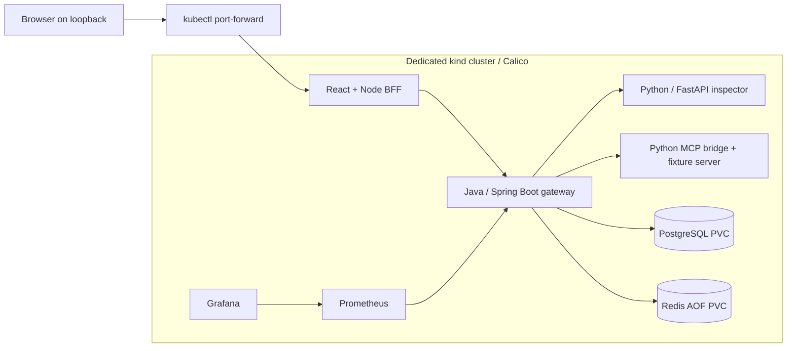

# Phase 7 — Local Kubernetes, Terraform and GitHub Actions

This deployment runs the existing security gateway and console in a dedicated local kind cluster with Calico enforcing NetworkPolicy. It uses mock generation and rule-only inspection. No provider key, paid cloud account, registry push or hosted model request is required.



## Ownership and prerequisites

kind owns the single-node cluster; `kind_bootstrap.py` owns Calico installation. Terraform owns the application namespace, service account, Secrets, ConfigMaps, PVCs, StatefulSets, migration Job, Deployments, Services and NetworkPolicies. Verification creates only temporary probe Pods and a temporary control namespace; recovery deletes runtime Pods so their existing controllers recreate them.

Use macOS/Linux on ARM64 or AMD64, Python 3, Docker with Compose and `docker image save --platform` support (API 1.48+), kubectl and curl. Keep enough Docker memory for the cluster and workloads; local validation used approximately 7.75 GiB allocated to Docker. Running Compose and kind together uses additional memory. No changes to the default kubeconfig are required.

Pinned versions: kind 0.33.0, Kubernetes 1.36.4 (node image digest pinned), Calico 3.32.2 (operator manifest digest checked), Terraform 1.16.4 and Kubernetes provider 3.2.1. Publisher checksums verify CLI downloads. The provider lock includes macOS ARM64 and Linux AMD64 checksums.

## Deploy from a clean checkout

```sh
python3 tools/setup_dev.py
python3 tools/install_deploy_tools.py
python3 tools/kind_bootstrap.py
python3 tools/deploy_local.py images
python3 tools/deploy_local.py init
python3 tools/deploy_local.py validate
python3 tools/deploy_local.py plan --monitoring
python3 tools/deploy_local.py apply --monitoring
python3 tools/check_kubernetes.py --exercise-recovery
```

The helper restricts Terraform to `kind-sentinellm` using `runtime/kind/kubeconfig`. Locally built application images remain in Docker/kind. PostgreSQL, Redis and optional monitoring images are pulled publicly. `--monitoring` is optional; pass it consistently to plan/apply commands to retain monitoring workloads.

Application credentials are generated privately in `.env`; the helper passes selected values through ephemeral Terraform variables into write-only Secret fields. Values are excluded from plans/state. The checker scans completed state and backups for configured credential values. `.env`, runtime, kubeconfig, state, plans and Terraform caches are ignored by Git and excluded from image builds. State still contains internal metadata and must remain private. Kubernetes Secrets remain readable to cluster administrators; this local deployment does not enable encryption at rest or external secret management.

## Present the Kubernetes demo

Run each forwarding command in its own terminal. Addresses bind only to loopback; all Kubernetes Services are ClusterIP.

```sh
kubectl --kubeconfig runtime/kind/kubeconfig --context kind-sentinellm -n sentinellm port-forward --address 127.0.0.1 service/console 13000:3000
kubectl --kubeconfig runtime/kind/kubeconfig --context kind-sentinellm -n sentinellm port-forward --address 127.0.0.1 service/gateway 18080:8080
kubectl --kubeconfig runtime/kind/kubeconfig --context kind-sentinellm -n sentinellm port-forward --address 127.0.0.1 service/prometheus 19090:9090
kubectl --kubeconfig runtime/kind/kubeconfig --context kind-sentinellm -n sentinellm port-forward --address 127.0.0.1 service/grafana 13001:3000
python3 tools/console_login.py --account operator
python3 tools/monitoring_login.py
python3 tools/demo.py --base http://127.0.0.1:18080
```

Open the console at http://127.0.0.1:13000 and Grafana at http://127.0.0.1:13001. The login helpers copy passwords to the macOS clipboard; on Linux, retrieve the separate console/Grafana passwords privately from `.env`. Keep login steps out of public recordings. The console helper prints the Compose URL; use port 13000 for this Kubernetes deployment. The Compose console remains on port 3000. Follow the existing [five-minute console walkthrough](../phase-4/README.md). Stop forwards before automated checks, which reserve ports 13000, 18080 and 19090.

## Demonstrate a Terraform change

```sh
python3 tools/deploy_local.py plan --monitoring --replicas 2
python3 tools/deploy_local.py apply --monitoring --replicas 2
python3 tools/check_kubernetes.py --replicas 2 --skip-network
python3 tools/deploy_local.py apply --monitoring
```

Two gateway Pods share PostgreSQL evidence and Redis budgets. This is a single-node scale demonstration, not high availability or a new throughput benchmark.

## Security boundaries and limits

Default-deny policies restrict both ingress and egress. Only the console can call the gateway; the gateway can call inspection, MCP, PostgreSQL and Redis; monitoring has only its required paths. Role Pods can resolve cluster DNS. DNS domain filtering and DNS-exfiltration defenses are outside this setup. Arbitrary direct external egress is denied, including hosted LLM traffic. The verification uses actual Pod sockets, five permitted internal paths, five denied internal paths, DNS, and an unrestricted external control probe before asserting external egress denial. If the control probe fails, the test fails rather than claiming policy enforcement.

Restricted Pod Security admission requires non-root containers, dropped capabilities, RuntimeDefault seccomp and no privilege escalation. Application root filesystems are read-only; databases and monitoring retain required writable paths. Service-account token automount is disabled. Policies use Pod labels and do not replace gateway authentication or protect against cluster administrators changing labels. Port-forward access follows the Kubernetes control-plane path and is outside the Pod-to-Pod policy tests.

PostgreSQL and Redis use local PVCs. Grafana/Prometheus data uses bounded emptyDir volumes and resets after Pod replacement; dashboard/configuration is reprovisioned. No ingress, TLS endpoint, cloud infrastructure, remote Terraform backend, production backup system or multi-node failover is claimed. [Phase 6 reliability limits](../phase-6/README.md) continue to apply.

## CI and cost

[GitHub Actions](../../.github/workflows/ci.yml) runs Java/Python/BFF checks, API-contract validation, real PostgreSQL/Redis integration, Compose security checks, Chromium console/monitoring checks and Prometheus rules. A second job builds local images, deploys kind/Calico with Terraform, verifies real network isolation and Pod recovery, scales the gateway, and destroys its disposable resources.

Browser tests use the [official Playwright container](https://playwright.dev/docs/docker), pinned to the same 1.63.0 version as the test package and to an image digest. Its preinstalled browsers/dependencies avoid per-run Ubuntu mirror downloads. Host networking is confined to this disposable Linux CI browser container so it can reach the loopback demo ports.

First-party actions are pinned to full commit SHAs, checkout does not persist credentials, and workflow permissions are read-only. Tests generate fresh synthetic credentials; no repository secrets or provider API key are needed. Public standard GitHub-hosted runners are free under [GitHub Actions billing](https://docs.github.com/en/billing/concepts/product-billing/github-actions). Private repositories are manual by default to avoid consuming an unverified allowance. Cloud resources, paid runners and model inference are outside this workflow.

See the [recovery runbook](runbook.md) and [verification evidence](verification.md).
